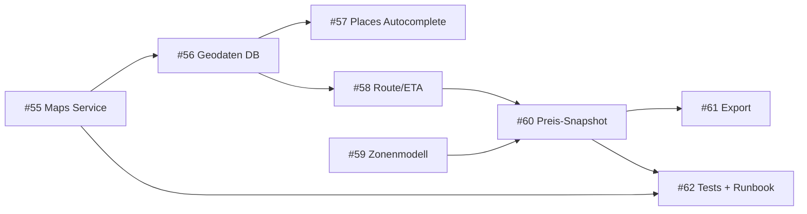

# ADR-010: Maps-Architektur und Zonenverrechnung (M8)

## Status

Accepted

## Date

2026-02-20

## Kontext

Das Dispo-System verwaltet Krankentransportfahrten im Raum Zuerich/Duebendorf. Bisher werden Fahrten rein manuell disponiert -- ohne Distanzberechnung, Fahrzeit-Schaetzung oder automatische Preisermittlung. Die Verrechnung erfolgt ausserhalb des Systems.

M8 schliesst diese Luecke mit drei Faehigkeiten:

1. **Geocoding**: Adressen von Patienten und Zielen in Koordinaten umwandeln
2. **Routing**: Distanz und Fahrzeit zwischen Patient und Ziel berechnen
3. **Zonenverrechnung**: PLZ-basiertes Tarifmodell mit versionierten Tarifregeln

### Bestehendes Datenmodell (relevant)

Tabelle `patients` hat: `street`, `house_number`, `postal_code` (CH 4-stellig), `city`.
Tabelle `destinations` hat: `street`, `house_number`, `postal_code` (CH 4-stellig), `city`.
Tabelle `rides` hat: `patient_id`, `destination_id`, `date`, `pickup_time`, `direction`, `status`, `driver_id`.

Beide Adress-Validierungen erzwingen bereits eine 4-stellige Schweizer PLZ (`/^\d{4}$/`).

### Zugehoerige Issues (M8)

| Issue | Thema |
|-------|-------|
| #54   | ADR (dieses Dokument) |
| #55   | Google Maps Service-Layer + Key-Management |
| #56   | DB Geodatenfelder (lat/lng, place_id, geocode_status) |
| #57   | Places Autocomplete + Place Details fuer Ziele |
| #58   | Route/Distanz/ETA in Disposition |
| #59   | Zonenmodell + Tarifmatrix |
| #60   | Preis-Snapshot pro Fahrt |
| #61   | Verrechnungs-Export |
| #62   | Tests + Kostenkontrolle + Runbook |

---

## 1. Google Maps API Scope

### Genutzte APIs

| API | Zweck | Aufruf-Zeitpunkt |
|-----|-------|-------------------|
| **Geocoding API** | Adresse -> lat/lng + place_id | Bei Patient/Ziel-Erstellung und -Aenderung |
| **Places API (New)** | Autocomplete bei Ziel-Eingabe + Place Details | Bei Ziel-Erstellung im UI (Client-seitig via Session Token) |
| **Directions API** | Distanz + Fahrzeit fuer eine Fahrt | Bei Fahrtenplanung (on-demand) |

### Bewusst NICHT genutzte APIs

| API | Grund |
|-----|-------|
| **Distance Matrix API** | Berechnet N:M Distanzen. Overkill fuer 1:1-Fahrten. Directions API genuegt und liefert zusaetzlich die Route. |
| **Maps JavaScript API** | Kartenanzeige im Browser. Nicht im Scope von M8; Disposition ist listenbasiert. Kann spaeter ergaenzt werden. |
| **Roads API** | Snap-to-Road fuer GPS-Tracking. Kein Live-Tracking in MVP. |
| **Elevation API** | Irrelevant fuer Fahrtpreise. |

### Kostenabschaetzung (Stand Feb 2026)

Annahme: 100 Fahrten/Tag, 22 Arbeitstage/Monat = 2'200 Fahrten/Monat.

| API | Aufrufe/Monat | Preis/1000 | Monatlich (USD) |
|-----|---------------|------------|-----------------|
| Geocoding | ~200 (nur bei neuen/geaenderten Adressen) | $5.00 | ~$1.00 |
| Places Autocomplete | ~500 Sessions (Ziel-Erfassung) | $17.00/Session | ~$8.50 |
| Places Details | ~500 (1 pro Session) | $17.00 | ~$8.50 |
| Directions | ~2'200 (1 pro Fahrt) | $5.00 | ~$11.00 |
| **Total** | | | **~$29/Monat** |

Google gewaehrt $200/Monat Gratisguthaben. Bei diesem Volumen fallen daher **keine Kosten** an.

**Kostenschutz**: Tages-Budget auf $20 im Google Cloud Project limitieren (Issue #62). Monitoring-Alert bei 80% Auslastung.

---

## 2. Service-Layer Architektur

### Modulstruktur

```
src/lib/maps/
  client.ts          -- Google Maps Client (server-only Singleton)
  geocode.ts         -- geocodeAddress(), reverseGeocode()
  directions.ts      -- getRoute() -> { distance_m, duration_s, polyline }
  places.ts          -- autocomplete(), getPlaceDetails()
  cache.ts           -- In-Memory + DB-Cache fuer Geocoding-Ergebnisse
  types.ts           -- Shared Types (GeoPoint, RouteResult, GeocodeResult)
  errors.ts          -- Maps-spezifische Error-Klassen
```

### Key-Management

| Variable | Kontext | Exposure |
|----------|---------|----------|
| `GOOGLE_MAPS_API_KEY` | Server-only: Geocoding, Directions | Kein `NEXT_PUBLIC_` Prefix. Nur in Server Actions und Route Handlers. |
| `NEXT_PUBLIC_GOOGLE_MAPS_API_KEY` | Client-only: Places Autocomplete Widget | Eingeschraenkt via HTTP-Referrer-Restriction im Google Cloud Project. Nur Places API (New) aktiviert. |

Zwei separate API-Keys:
- **Server-Key**: Unrestricted by referrer, restricted by IP (Vercel deployment IPs). Geocoding + Directions aktiviert.
- **Client-Key**: Restricted by HTTP referrer (`*.vercel.app`, eigene Domain). Nur Places API (New) aktiviert.

### Caching-Strategie

| Datentyp | Cache-Ort | TTL | Grund |
|----------|-----------|-----|-------|
| Geocoding (Adresse -> lat/lng) | DB-Spalten auf `patients`/`destinations` | Unbegrenzt (bis Adresse sich aendert) | Adressen aendern sich selten; Ergebnis wird persistiert. |
| Directions (Route A->B) | Kein Cache | -- | Verkehrsdaten aendern sich; Preis wird als Snapshot auf `rides` gespeichert. |
| Places Autocomplete | Kein Cache (Google TOS verbietet Caching) | -- | Session-Token-basiert, Client-seitig. |

**Bewusste Entscheidung**: Kein Redis/Memcached. Die DB-Persistierung der Geocoding-Ergebnisse genuegt. Directions-Aufrufe sind pro Fahrt einmalig und guenstig.

### Error- und Retry-Handling

```typescript
// src/lib/maps/client.ts (Pseudocode)
const MAX_RETRIES = 2
const RETRY_DELAY_MS = 500

async function callMapsApi<T>(fn: () => Promise<T>): Promise<T> {
  for (let attempt = 0; attempt <= MAX_RETRIES; attempt++) {
    try {
      return await fn()
    } catch (error) {
      if (isRetryable(error) && attempt < MAX_RETRIES) {
        await delay(RETRY_DELAY_MS * (attempt + 1))
        continue
      }
      throw new MapsApiError(error)
    }
  }
  throw new MapsApiError("Max retries exceeded")
}

function isRetryable(error: unknown): boolean {
  // Retry on: OVER_QUERY_LIMIT, UNKNOWN_ERROR, network errors
  // Do NOT retry on: INVALID_REQUEST, ZERO_RESULTS, REQUEST_DENIED
}
```

### Rate Limiting

- Google Maps APIs haben eigene Limits (50 QPS fuer Geocoding, 50 QPS fuer Directions).
- Bei unserem Volumen (< 1 QPS) kein anwendungsseitiges Rate Limiting noetig.
- **Schutz**: Server-seitige Aufrufe sind nur aus authentifizierten Server Actions moeglich. Kein oeffentliches Proxy-Endpoint.
- **Monitoring**: Fehlerrate und Latenz in Console-Logs (strukturiert). Spaeter Observability-Stack.

---

## 3. Geodaten-Modell

### Neue Felder auf `patients` und `destinations`

```sql
-- Migration: Geodatenfelder fuer patients
ALTER TABLE public.patients ADD COLUMN lat double precision;
ALTER TABLE public.patients ADD COLUMN lng double precision;
ALTER TABLE public.patients ADD COLUMN place_id text;
ALTER TABLE public.patients ADD COLUMN formatted_address text;
ALTER TABLE public.patients ADD COLUMN geocode_status text
  NOT NULL DEFAULT 'pending'
  CHECK (geocode_status IN ('pending', 'success', 'failed', 'manual'));
ALTER TABLE public.patients ADD COLUMN geocode_updated_at timestamptz;

-- Gleiche Felder fuer destinations
ALTER TABLE public.destinations ADD COLUMN lat double precision;
ALTER TABLE public.destinations ADD COLUMN lng double precision;
ALTER TABLE public.destinations ADD COLUMN place_id text;
ALTER TABLE public.destinations ADD COLUMN formatted_address text;
ALTER TABLE public.destinations ADD COLUMN geocode_status text
  NOT NULL DEFAULT 'pending'
  CHECK (geocode_status IN ('pending', 'success', 'failed', 'manual'));
ALTER TABLE public.destinations ADD COLUMN geocode_updated_at timestamptz;
```

### Feld-Semantik

| Feld | Typ | Beschreibung |
|------|-----|--------------|
| `lat` | `double precision` | Breitengrad (WGS84). NULL bis Geocoding erfolgt. |
| `lng` | `double precision` | Laengengrad (WGS84). NULL bis Geocoding erfolgt. |
| `place_id` | `text` | Google Place ID. Erlaubt spaeteres Nachschlagen. |
| `formatted_address` | `text` | Von Google normalisierte Adresse. Zur Anzeige und Plausibilitaetspruefung. |
| `geocode_status` | `text (CHECK)` | `pending` (noch nicht geocodet), `success`, `failed`, `manual` (handkorrigiert). |
| `geocode_updated_at` | `timestamptz` | Zeitpunkt des letzten Geocoding-Versuchs. |

### Warum kein PostGIS?

| Kriterium | PostGIS | Einfache lat/lng Spalten |
|-----------|---------|--------------------------|
| Zonenmatching | Polygon-Intersection | PLZ-Lookup (String-Vergleich) |
| Distanzberechnung | ST_Distance | Google Directions API (exakte Fahrstrecke) |
| Komplexitaet | Extension aktivieren, GIS-Datentypen, Spatial Indexes | Zwei FLOAT-Spalten |
| Supabase-hosted | Verfuegbar | Verfuegbar |

**Entscheidung**: Kein PostGIS. Unsere Zonen sind PLZ-basiert (String-Lookup), und Distanzen werden via Directions API berechnet (Strassenroute, nicht Luftlinie). PostGIS waere erst relevant bei Polygon-Geofencing oder Proximity-Queries -- beides nicht im Scope.

### Fallback-Strategie bei fehlenden Koordinaten

1. **Geocoding fehlgeschlagen** (`geocode_status = 'failed'`): Fahrt kann trotzdem erstellt werden. Preis kann nicht automatisch berechnet werden. UI zeigt Warnung "Adresse konnte nicht verifiziert werden".
2. **PLZ vorhanden, Koordinaten fehlen**: Zonenmatching funktioniert trotzdem (PLZ-basiert). Nur die Distanzberechnung faellt aus.
3. **Manueller Override**: Disponent kann `geocode_status = 'manual'` setzen und Koordinaten handisch eingeben.
4. **Re-Geocoding**: Admin kann Geocoding fuer einzelne Adressen oder als Batch erneut triggern.

---

## 4. Zonenmodell (Verrechnung)

### Entscheidung: PLZ-basierte Zonen

Drei Optionen wurden evaluiert:

| Option | Beschreibung | Aufwand | Flexibilitaet |
|--------|-------------|---------|---------------|
| **A: PLZ-basiert** | Jede PLZ gehoert genau einer Zone | Gering | Hoch fuer CH (PLZ = Gemeinde) |
| B: Polygon-basiert | Zonen als GPS-Polygone (GeoJSON) | Hoch (PostGIS, Editor) | Maximal |
| C: Radial (km vom Zentrum) | Kreise um einen Mittelpunkt | Mittel | Ungenau bei Stadtgrenzen |

**Entscheidung: Option A (PLZ-basiert).**

Gruende:
- Schweizer PLZ bilden Gemeinden exakt ab. Jede 4-stellige PLZ ist eindeutig einer Ortschaft zugeordnet.
- Bestehende Daten haben bereits validierte 4-stellige PLZ auf `patients` und `destinations`.
- Kein PostGIS, kein Polygon-Editor, keine Spatial Queries noetig.
- Spaeterer Wechsel zu Polygon-Zonen ist moeglich, da die PLZ-Zuordnung additiv ist.
- Fuer den Grossraum Zuerich reicht die PLZ-Granularitaet.

### Tabellenstruktur

```sql
-- Geografische Zone (Sammlung von PLZ)
CREATE TABLE public.zones (
  id          uuid PRIMARY KEY DEFAULT gen_random_uuid(),
  name        text NOT NULL,           -- z.B. "Duebendorf", "Zuerich Nord"
  description text,
  is_active   boolean NOT NULL DEFAULT true,
  created_at  timestamptz NOT NULL DEFAULT now(),
  updated_at  timestamptz NOT NULL DEFAULT now()
);

-- Zuordnung PLZ -> Zone (M:1, eine PLZ gehoert genau einer Zone)
CREATE TABLE public.zone_postal_codes (
  id          uuid PRIMARY KEY DEFAULT gen_random_uuid(),
  zone_id     uuid NOT NULL REFERENCES public.zones(id) ON DELETE CASCADE,
  postal_code text NOT NULL,
  UNIQUE (postal_code)                -- Eine PLZ kann nur einer Zone zugeordnet sein
);

CREATE INDEX idx_zone_postal_codes_postal_code ON public.zone_postal_codes(postal_code);
CREATE INDEX idx_zone_postal_codes_zone_id ON public.zone_postal_codes(zone_id);

-- Tarifversionen (Zeitscheiben fuer Tarifaenderungen)
CREATE TABLE public.fare_versions (
  id          uuid PRIMARY KEY DEFAULT gen_random_uuid(),
  name        text NOT NULL,           -- z.B. "Tarif 2026 Q1"
  valid_from  date NOT NULL,
  valid_to    date,                    -- NULL = unbegrenzt gueltig
  is_active   boolean NOT NULL DEFAULT true,
  created_at  timestamptz NOT NULL DEFAULT now(),
  updated_at  timestamptz NOT NULL DEFAULT now(),
  CONSTRAINT fare_versions_date_order CHECK (valid_to IS NULL OR valid_to > valid_from)
);

-- Tarifregeln: Von-Zone x Nach-Zone -> Preis
CREATE TABLE public.fare_rules (
  id              uuid PRIMARY KEY DEFAULT gen_random_uuid(),
  fare_version_id uuid NOT NULL REFERENCES public.fare_versions(id) ON DELETE CASCADE,
  from_zone_id    uuid NOT NULL REFERENCES public.zones(id),
  to_zone_id      uuid NOT NULL REFERENCES public.zones(id),
  base_price      numeric(8,2) NOT NULL,   -- Grundpreis in CHF
  price_per_km    numeric(6,2) NOT NULL DEFAULT 0,  -- Kilometerpreis in CHF
  created_at      timestamptz NOT NULL DEFAULT now(),
  updated_at      timestamptz NOT NULL DEFAULT now(),
  UNIQUE (fare_version_id, from_zone_id, to_zone_id)
);

CREATE INDEX idx_fare_rules_version ON public.fare_rules(fare_version_id);
CREATE INDEX idx_fare_rules_zones ON public.fare_rules(from_zone_id, to_zone_id);
```

### Zonenzuordnungs-Logik (Pseudocode)

```typescript
// src/lib/billing/zone-lookup.ts
async function getZoneForPostalCode(postalCode: string): Promise<Zone | null> {
  const { data } = await supabase
    .from('zone_postal_codes')
    .select('zone_id, zones(*)')
    .eq('postal_code', postalCode)
    .single()
  return data?.zones ?? null
}

async function getFareRule(
  fromPostalCode: string,
  toPostalCode: string,
  date: string
): Promise<FareRule | null> {
  const fromZone = await getZoneForPostalCode(fromPostalCode)
  const toZone = await getZoneForPostalCode(toPostalCode)
  if (!fromZone || !toZone) return null

  const { data } = await supabase
    .from('fare_rules')
    .select('*, fare_versions!inner(*)')
    .eq('from_zone_id', fromZone.id)
    .eq('to_zone_id', toZone.id)
    .eq('fare_versions.is_active', true)
    .lte('fare_versions.valid_from', date)
    .or(`valid_to.is.null,valid_to.gte.${date}`, { referencedTable: 'fare_versions' })
    .single()

  return data
}
```

### Startgebiet: Duebendorf + Grossraum Zuerich

Initiale Zonen-Konfiguration (Seed-Daten, nicht in Migration):

| Zone | PLZ (Auswahl) |
|------|---------------|
| **Duebendorf** | 8600, 8606 (Greifensee), 8607 (Aathal) |
| **Zuerich Stadt** | 8001-8064 |
| **Zuerich Nord** | 8050, 8051, 8052, 8057 |
| **Zuerich Ost** | 8008, 8032, 8044, 8053 |
| **Glattal** | 8152 (Glattbrugg), 8302 (Kloten), 8303 (Bassersdorf), 8304 (Wallisellen), 8305 (Dietlikon) |
| **Winterthur** | 8400-8411 |

Die exakte PLZ-Zuordnung wird als Seed-Script (nicht Migration) bereitgestellt und ist aenderbar ohne Deployment.

---

## 5. Preis-Snapshot

### Neue Felder auf `rides`

```sql
ALTER TABLE public.rides ADD COLUMN distance_meters integer;
ALTER TABLE public.rides ADD COLUMN duration_seconds integer;
ALTER TABLE public.rides ADD COLUMN calculated_price numeric(8,2);
ALTER TABLE public.rides ADD COLUMN fare_rule_id uuid REFERENCES public.fare_rules(id) ON DELETE SET NULL;
ALTER TABLE public.rides ADD COLUMN price_override numeric(8,2);
ALTER TABLE public.rides ADD COLUMN price_override_reason text;
```

### Feld-Semantik

| Feld | Typ | Beschreibung |
|------|-----|--------------|
| `distance_meters` | `integer` | Strecke gemaess Google Directions (Meter). Snapshot bei Planung. |
| `duration_seconds` | `integer` | Fahrzeit gemaess Google Directions (Sekunden). Snapshot bei Planung. |
| `calculated_price` | `numeric(8,2)` | Automatisch berechneter Preis: `base_price + (distance_meters / 1000) * price_per_km`. |
| `fare_rule_id` | `uuid (FK)` | Referenz auf die angewendete Tarifregel. `ON DELETE SET NULL` -- historische Fahrten bleiben, auch wenn Tarifregeln entfernt werden. |
| `price_override` | `numeric(8,2)` | Manuell ueberschriebener Preis (durch Disponent). |
| `price_override_reason` | `text` | Pflicht-Begruendung bei manuellem Override. |

### Berechnungszeitpunkt

- **Bei Fahrtenplanung**: Wenn Patient, Ziel und Datum gesetzt sind und beide Adressen geocodet sind.
- **Nicht rueckwirkend**: Einmal berechnete Preise aendern sich nicht. Grund: Abrechnung muss reproduzierbar sein.
- **Effektiver Preis**: `COALESCE(price_override, calculated_price)`.
- **Zod-Validierung**: Wenn `price_override` gesetzt ist, muss `price_override_reason` ebenfalls gesetzt sein (`.superRefine()`).

### Preisberechnung (Pseudocode)

```typescript
// src/lib/billing/calculate-price.ts
interface PriceCalculation {
  calculated_price: number
  fare_rule_id: string
  distance_meters: number
  duration_seconds: number
}

async function calculateRidePrice(
  patientPostalCode: string,
  destinationPostalCode: string,
  patientCoords: GeoPoint,
  destinationCoords: GeoPoint,
  rideDate: string
): Promise<PriceCalculation | null> {
  // 1. Zone-Lookup via PLZ
  const fareRule = await getFareRule(patientPostalCode, destinationPostalCode, rideDate)
  if (!fareRule) return null  // Keine Tarifregel -> kein automatischer Preis

  // 2. Route via Directions API
  const route = await getRoute(patientCoords, destinationCoords)

  // 3. Preis berechnen
  const distanceKm = route.distance_meters / 1000
  const price = fareRule.base_price + distanceKm * fareRule.price_per_km

  return {
    calculated_price: Math.round(price * 100) / 100,  // 2 Dezimalstellen
    fare_rule_id: fareRule.id,
    distance_meters: route.distance_meters,
    duration_seconds: route.duration_seconds,
  }
}
```

---

## 6. Datenschutz / DSGVO / DSG (Schweiz)

### Risikobewertung

| Aspekt | Bewertung | Massnahme |
|--------|-----------|-----------|
| **Adressen an Google** | Patientenadressen (Strasse, PLZ, Ort) werden an Google Geocoding/Directions gesendet. **Keine Patientennamen, keine Gesundheitsdaten.** | Pseudonymisiert: Adresse ohne Namen ist kein Personendatum im engeren Sinn. |
| **Google Cloud Standort** | Google verarbeitet Daten global. EU/CH Standard Contractual Clauses (SCC) noetig. | Google Cloud ist unter CH-US Data Privacy Framework zertifiziert. |
| **Places Autocomplete** | Client-seitig: Browser sendet Suchanfragen direkt an Google. | Nur fuer Ziel-Adressen (nicht Patienten). Patienten-Adressen werden server-seitig geocodet. |
| **Logging** | Maps-API-Responses koennen Adressen enthalten. | Keine Patientennamen in Logs. `formatted_address` wird in DB gespeichert, nicht in Logfiles. |
| **Auftragsverarbeitung** | Google Maps Platform faellt unter Google Cloud Platform TOS, die einen AVV (Auftragsverarbeitungsvertrag) einschliessen. | Google Cloud DPA akzeptieren in der Admin Console (einmalig). |

### Technische Massnahmen

1. **Server-seitiges Geocoding fuer Patienten**: Patientenadressen werden nie im Client an Google gesendet. Nur die Server Action ruft die Geocoding API auf.
2. **Client-seitiges Autocomplete nur fuer Ziele**: Zieladressen (Spitaeler, Praxen) sind keine sensitiven Daten.
3. **Kein Patient-Name in API-Calls**: Die Maps API erhaelt nur `street, house_number, postal_code, city` -- nie `first_name`, `last_name`.
4. **Structured Logging**: Maps-API-Aufrufe loggen `geocode_status`, Latenz, Fehlercode -- aber nie die vollstaendige Adresse.

### DSG (Schweiz) vs. DSGVO

Das Schweizer Datenschutzgesetz (revDSG, seit Sept 2023) ist in den relevanten Punkten aequivalent zur DSGVO. Google Cloud Switzerland (Region `europe-west6`, Zuerich) kann fuer Supabase nicht direkt gewaehlt werden (Supabase nutzt AWS EU-Frankfurt), aber die Maps-API-Anfragen sind transiente Daten ohne Speicherung bei Google ueber die API-Antwort hinaus.

---

## 7. Spaetere Erweiterungen (Zielbild)

Die Architektur ist so gestaltet, dass folgende Erweiterungen **ohne Schema-Rewrite** moeglich sind:

### 7.1 Wartezeit-Zuschlaege

Neues Feld `waiting_minutes` auf `rides`. Neue Spalte `price_per_waiting_minute` auf `fare_rules`. Preisformel erweitert sich zu:

```
price = base_price + (km * price_per_km) + (waiting_min * price_per_waiting_minute)
```

### 7.2 Nachtzuschlaege (zeitbasiert)

Neue Tabelle `fare_surcharges` mit:
- `fare_version_id`, `surcharge_type` ('night', 'weekend', 'holiday')
- `time_from`, `time_to` (fuer Nacht: 20:00-06:00)
- `surcharge_percent` oder `surcharge_flat`

Preisberechnung prueft `pickup_time` gegen Surcharge-Zeitfenster.

### 7.3 Sonderfahrten (Fahrzeugtyp-Zuschlag)

Feld `vehicle_type` existiert bereits auf `drivers`. Neue Spalte `vehicle_type_surcharge` auf `fare_rules` oder separate Lookup-Tabelle. Rollstuhl- und Liegendtransporte koennten einen Aufschlag erhalten.

### 7.4 Multi-Carrier-Verrechnung

Wenn mehrere Transportunternehmen ueber das System disponiert werden:
- Neue Tabelle `carriers` mit eigenen Tarifmatrizen
- `fare_versions.carrier_id` als optionaler FK
- `drivers.carrier_id` als Zuordnung

### 7.5 Kartenanzeige

- Google Maps JavaScript API fuer Kartenansicht in der Disposition
- Erfordert nur den bestehenden Client-Key (Referrer-Restriction erweitern)
- Fahrer-Standorte via Driver App (out of scope fuer M8)

---

## 8. Betroffene Dateien pro Issue

### Issue #55: Google Maps Service-Layer + Key-Management

| Aktion | Datei |
|--------|-------|
| NEU | `src/lib/maps/client.ts` -- Google Maps Client Singleton |
| NEU | `src/lib/maps/geocode.ts` -- geocodeAddress(), batchGeocode() |
| NEU | `src/lib/maps/directions.ts` -- getRoute() |
| NEU | `src/lib/maps/places.ts` -- Server-Proxy fuer Place Details |
| NEU | `src/lib/maps/types.ts` -- GeoPoint, RouteResult, GeocodeResult |
| NEU | `src/lib/maps/errors.ts` -- MapsApiError, GeocodeFailedError |
| AENDERN | `.env.local` / `.env.example` -- GOOGLE_MAPS_API_KEY, NEXT_PUBLIC_GOOGLE_MAPS_API_KEY |

### Issue #56: DB Geodatenfelder

| Aktion | Datei |
|--------|-------|
| NEU | `supabase/migrations/2026XXXX_XXXXXX_geodata_fields.sql` |
| AENDERN | `src/lib/types/database.ts` -- lat, lng, place_id, formatted_address, geocode_status, geocode_updated_at auf patients + destinations |
| AENDERN | `src/actions/patients.ts` -- Geocoding nach create/update triggern |
| AENDERN | `src/actions/destinations.ts` -- Geocoding nach create/update triggern |

### Issue #57: Places Autocomplete + Place Details

| Aktion | Datei |
|--------|-------|
| NEU | `src/components/shared/places-autocomplete.tsx` -- Client-Komponente mit Google Places Widget |
| AENDERN | `src/components/destinations/destination-form.tsx` -- Autocomplete fuer Adressfelder |
| AENDERN | `src/lib/validations/destinations.ts` -- Optionale place_id, formatted_address Felder |

### Issue #58: Route/Distanz/ETA in Disposition

| Aktion | Datei |
|--------|-------|
| AENDERN | `src/actions/rides.ts` -- Distanz/Fahrzeit bei createRide() und updateRide() berechnen |
| NEU | `src/lib/billing/calculate-price.ts` -- Preisberechnungslogik |
| NEU | `src/lib/billing/types.ts` -- PriceCalculation, FareRule Types |
| AENDERN | `src/components/rides/ride-form.tsx` -- Distanz/ETA/Preis-Anzeige |

### Issue #59: Zonenmodell + Tarifmatrix

| Aktion | Datei |
|--------|-------|
| NEU | `supabase/migrations/2026XXXX_XXXXXX_zones_fares.sql` -- zones, zone_postal_codes, fare_versions, fare_rules |
| NEU | `supabase/seed/zones.sql` -- Initiale Zonen + PLZ-Zuordnung Zuerich/Duebendorf |
| AENDERN | `src/lib/types/database.ts` -- Neue Tabellen-Types |
| NEU | `src/lib/billing/zone-lookup.ts` -- getZoneForPostalCode(), getFareRule() |
| NEU | `src/app/(dashboard)/settings/zones/page.tsx` -- Zonen-Verwaltung (CRUD) |
| NEU | `src/app/(dashboard)/settings/fares/page.tsx` -- Tarif-Verwaltung (CRUD) |
| NEU | `src/actions/zones.ts` -- Server Actions fuer Zonen |
| NEU | `src/actions/fares.ts` -- Server Actions fuer Tarife |
| NEU | `src/lib/validations/zones.ts` -- Zod-Schemas |
| NEU | `src/lib/validations/fares.ts` -- Zod-Schemas |

### Issue #60: Preis-Snapshot pro Fahrt

| Aktion | Datei |
|--------|-------|
| NEU | `supabase/migrations/2026XXXX_XXXXXX_ride_price_fields.sql` -- distance_meters, duration_seconds, calculated_price, fare_rule_id, price_override, price_override_reason |
| AENDERN | `src/lib/types/database.ts` -- Neue Felder auf rides |
| AENDERN | `src/actions/rides.ts` -- Preis berechnen + speichern bei createRide()/updateRide() |
| AENDERN | `src/lib/validations/rides.ts` -- price_override + price_override_reason mit superRefine |
| AENDERN | `src/components/rides/ride-form.tsx` -- Preis-Anzeige + Override-Felder |

### Issue #61: Verrechnungs-Export

| Aktion | Datei |
|--------|-------|
| NEU | `src/app/api/export/billing/route.ts` -- CSV/Excel-Export Route Handler |
| NEU | `src/lib/billing/export.ts` -- Exportlogik (Datumsbereich, Filterung) |
| NEU | `src/app/(dashboard)/billing/page.tsx` -- Verrechnungs-Uebersicht |
| NEU | `src/components/billing/billing-table.tsx` -- Verrechnungsliste |
| NEU | `src/components/billing/export-button.tsx` -- Download-Button |

### Issue #62: Tests + Kostenkontrolle + Runbook

| Aktion | Datei |
|--------|-------|
| NEU | `src/lib/maps/__tests__/geocode.test.ts` -- Unit Tests mit gemockter Maps API |
| NEU | `src/lib/maps/__tests__/directions.test.ts` -- Unit Tests |
| NEU | `src/lib/billing/__tests__/calculate-price.test.ts` -- Preisberechnung Tests |
| NEU | `src/lib/billing/__tests__/zone-lookup.test.ts` -- Zonen-Lookup Tests |
| NEU | `docs/runbooks/maps-cost-monitoring.md` -- Runbook: API-Kosten, Budgets, Alerts |
| AENDERN | `.github/workflows/` -- Ggf. E2E-Tests erweitern |

---

## 9. RLS-Policies fuer neue Tabellen

### zones, zone_postal_codes

```sql
-- Alle authentifizierten Benutzer duerfen Zonen lesen (fuer Preis-Anzeige)
ALTER TABLE public.zones ENABLE ROW LEVEL SECURITY;
CREATE POLICY "zones_select_authenticated" ON public.zones
  FOR SELECT TO authenticated USING (true);
CREATE POLICY "zones_manage_staff" ON public.zones
  FOR ALL TO authenticated USING (get_user_role() IN ('admin', 'operator'));

ALTER TABLE public.zone_postal_codes ENABLE ROW LEVEL SECURITY;
CREATE POLICY "zone_postal_codes_select_authenticated" ON public.zone_postal_codes
  FOR SELECT TO authenticated USING (true);
CREATE POLICY "zone_postal_codes_manage_staff" ON public.zone_postal_codes
  FOR ALL TO authenticated USING (get_user_role() IN ('admin', 'operator'));
```

### fare_versions, fare_rules

```sql
ALTER TABLE public.fare_versions ENABLE ROW LEVEL SECURITY;
CREATE POLICY "fare_versions_select_authenticated" ON public.fare_versions
  FOR SELECT TO authenticated USING (true);
CREATE POLICY "fare_versions_manage_admin" ON public.fare_versions
  FOR ALL TO authenticated USING (get_user_role() = 'admin');

ALTER TABLE public.fare_rules ENABLE ROW LEVEL SECURITY;
CREATE POLICY "fare_rules_select_authenticated" ON public.fare_rules
  FOR SELECT TO authenticated USING (true);
CREATE POLICY "fare_rules_manage_admin" ON public.fare_rules
  FOR ALL TO authenticated USING (get_user_role() = 'admin');
```

**Begründung**: Zonen koennen von Operator+Admin verwaltet werden (operative Entscheidung). Tarife duerfen nur Admins aendern (finanzielle Entscheidung).

---

## 10. Migrationsreihenfolge

Die Issues muessen in dieser Reihenfolge implementiert werden:



Parallelisierung moeglich:
- **#55 + #59** koennen parallel gestartet werden (Maps-Client vs. Zonen-Schema)
- **#57 + #58** koennen parallel nach #56 laufen
- **#62** kann parallel zu #61 laufen, aber nach #55 und #60

---

## Konsequenzen

### Positiv

- **Automatische Preisberechnung** reduziert manuelle Fehler und Dispositionsaufwand
- **PLZ-basiertes Zonenmodell** ist einfach verstaendlich und wartbar
- **Versionierte Tarife** ermoeglichen Preisaenderungen ohne historische Daten zu verlieren
- **Preis-Snapshot** garantiert nachvollziehbare Abrechnung
- **Google Maps Free Tier** deckt das erwartete Volumen ab -- keine laufenden Kosten

### Negativ

- **Abhaengigkeit von Google Maps**: Vendor Lock-in fuer Geocoding und Routing. Alternativen (Mapbox, HERE) waeren Aufwand ~2 Tage fuer Service-Layer-Austausch dank Abstraktionsschicht.
- **Zwei API-Keys**: Erhoehte Konfigurationskomplexitaet. Wird durch `.env.example` und Dokumentation mitigiert.
- **PLZ-Granularitaet**: Innerhalb einer PLZ gibt es keine Preisdifferenzierung. Fuer den Grossraum Zuerich akzeptabel, bei Expansion in laendliche Gebiete mit grossen PLZ-Bereichen ggf. zu grob.

### Risiken

| Risiko | Wahrscheinlichkeit | Impact | Mitigation |
|--------|---------------------|--------|------------|
| Google aendert Preise | Mittel | Mittel | Budget-Limit, Monitoring, Service-Abstraktionsschicht |
| Google Geocoding liefert falsche Koordinaten | Gering | Gering | `formatted_address` zur Plausibilitaetspruefung, manueller Override |
| PLZ nicht in Zonenmatrix | Mittel (neue Patienten) | Gering | UI-Warnung "Keine Tarifregel gefunden", manueller Preis-Override |
| Free Tier wird ueberschritten | Gering (bei < 200 Fahrten/Tag) | Gering ($29/Monat) | Budget-Alert bei 80%, Dashboard in Google Cloud Console |
| Tarifaenderung mitten im Monat | Mittel | Mittel | `valid_from/valid_to` auf fare_versions, bereits geplante Fahrten behalten ihren Snapshot |
